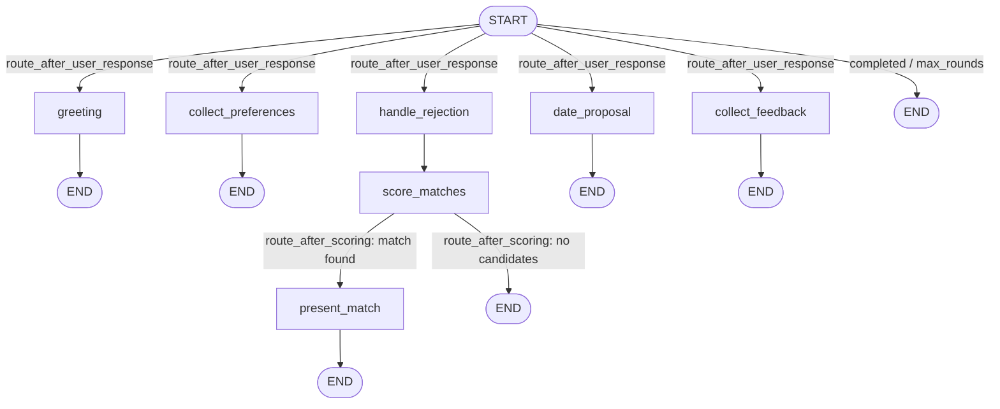

# Ditto Synthetic Matchmaking Feedback Loop Simulator

A multi-agent simulation system that generates synthetic matchmaking conversations, mimicking Ditto AI's college dating platform. The system bootstraps a feedback loop by simulating realistic interactions between a matchmaking bot and persona-driven user bots.

## Architecture

```
┌───────────────────────────────────────────────────┐
│          Interactive Streamlit UI (app.py)        │
│👤 Persona Studio│ 💬Simulation Arena│ 📊 Analytics │
└──────────────────────┬────────────────────────────┘
                       │
┌──────────────────────▼────────────────────────────┐
│               Simulation Orchestrator             │
│  Manages conversation loops, logging, drop-offs   │
├───────────────────────────────────────────────────┤
│                                                   │
│  ┌──────────────────┐    ┌──────────────────────┐ │
│  │    Ditto Bot     │◄──►│   Customer Bot       │ │
│  │  (Matchmaker)    │    │  (Persona-driven)    │ │
│  │                  │    │                      │ │
│  │ • Match scoring  │    │ • Naturalistic chat  │ │
│  │ • Preference     │    │ • Ghosting/noise     │ │
│  │   tracking       │    │ • Frustration model  │ │
│  │ • Date proposal  │    │ • Post-date ratings  │ │
│  └────────┬─────────┘    └──────────────────────┘ │
│           │                                       │
│  ┌────────▼─────────┐                             │
│  │   Match Scorer   │                             │
│  │  Embedding (40%) │                             │
│  │  + LLM CoT (60%) │                             │
│  └──────────────────┘                             │
├───────────────────────────────────────────────────┤
│              Persona Generator                    │
│   Diverse synthetic college student profiles      │
└───────────────────────────────────────────────────┘
         ▼                        ▼
   persona_pool.jsonl      conversations_*.jsonl
         ▼                        ▼
 ┌──────────────────────────────────────────────────┐
 │         MongoDB Persistence Layer (Opt-in)       │
 └──────────────────────────────────────────────────┘
```

## LangGraph Architecture

The Ditto Bot conversation is now orchestrated by a **LangGraph `StateGraph`** defined in `src/ditto_bot/graph.py`. Instead of a monolithic phase-driven loop, each matchmaking step is a discrete node in a compiled graph. The `SimulationEngine` invokes the graph once per turn, passing the current `DittoState`; LangGraph's conditional edges handle all phase transitions automatically.

### Graph Topology



**Linear happy path:**
```
START → greeting → END
      → collect_preferences → END
      → score_matches → present_match → END
      → date_proposal → END
      → collect_feedback → END
```

**Rejection loop (up to `max_rounds`):**
```
START → handle_rejection → score_matches → present_match → END
                                        ↘ END  (no candidates left)
```

**Max rounds reached:**
```
START → END  (route_after_user_response returns "completed")
```

### Node Functions

| Node | Function | Responsibility |
|------|----------|----------------|
| 1 | `greeting_node` | Generates the opening greeting and transitions phase to `collecting_preferences` |
| 2 | `collect_preferences_node` | Collects user preferences conversationally; transitions to `presenting_match` after ≥ 2 user turns |
| 3 | `score_matches_node` | Runs `MatchScorer` (embedding + LLM CoT) to rank candidates and selects the top result |
| 4 | `present_match_node` | Formats and presents the current match to the user using `MATCH_PRESENTATION_PROMPT` |
| 5 | `handle_rejection_node` | Acknowledges the rejection, extracts the reason, and appends it to `rejection_reasons` |
| 6 | `date_proposal_node` | Proposes a date for the accepted match using `DATE_PROPOSAL_PROMPT` and sets `accepted_match` |
| 7 | `collect_feedback_node` | Requests post-date feedback and marks the conversation phase as `completed` |

### `DittoState` Schema

`DittoState` is a `TypedDict` (defined in `src/ditto_bot/graph.py`) that serves as the shared state passed between all graph nodes. Every node reads from it and returns a partial dict update.

| Field | Type | Tracks |
|-------|------|--------|
| `messages` | `Annotated[list[BaseMessage], add_messages]` | Full conversation history; new messages are **appended** automatically via the `add_messages` reducer |
| `phase` | `str` | Current conversation phase (e.g. `"greeting"`, `"collecting_preferences"`, `"presenting_match"`, `"post_date_feedback"`, `"completed"`) |
| `user_persona` | `dict` | The active user's `Persona` serialized as a plain dict |
| `persona_pool` | `list[dict]` | All available candidate personas (serialized dicts) for match scoring |
| `user_preferences` | `list[str]` | Accumulated preference statements extracted from user messages |
| `rejection_reasons` | `list[str]` | Reasons given for each rejected match (used to improve subsequent scoring) |
| `shown_match_ids` | `list[str]` | IDs of candidates already presented (prevents re-presenting the same match) |
| `current_match` | `dict \| None` | The top-scored `MatchResult` for the current round, serialized as a dict |
| `accepted_match` | `dict \| None` | The match the user accepted (set by `date_proposal_node`); `None` until acceptance |
| `current_round` | `int` | Number of match rounds completed so far |
| `max_rounds` | `int` | Maximum allowed match rounds before the conversation ends (default: `6`) |
| `llm_model` | `str` | Ollama model name used for conversational LLM calls (e.g. `"llama3.2"`) |
| `embedding_model` | `str` | Ollama model name used for embeddings (e.g. `"nomic-embed-text"`) |

### Unchanged Components

The LangGraph integration is a **drop-in orchestration layer** — the following components are **unchanged**:

- **`CustomerBot`** (`src/customer_bot/agent.py`) — persona-driven user simulation with frustration model, ghosting, and noise injection
- **`MatchScorer`** (`src/ditto_bot/matcher.py`) — hybrid 40% embedding + 60% LLM chain-of-thought scoring
- **Prompt templates** (`src/ditto_bot/prompts.py`) — all 5 prompts (`DITTO_SYSTEM_PROMPT`, `MATCH_PRESENTATION_PROMPT`, `REJECTION_HANDLING_PROMPT`, `DATE_PROPOSAL_PROMPT`, `POST_DATE_FEEDBACK_PROMPT`)
- **Pydantic models** (`src/models/persona.py`, `src/models/conversation.py`) — `Persona`, `DatingPreferences`, `ConversationLog`, `Turn`, `MatchPresented`, etc.

## LLM Output Resilience

Local LLMs — especially smaller models like `llama3.2` — can produce malformed JSON that breaks structured output parsing. Common failure modes include unescaped inner quotes (e.g. a height value like `5'5"`), output truncated by token limits, and trailing commas in objects or arrays.

To keep simulations running without manual intervention, the pipeline uses a **3-layer defence**:

- **Layer 1 — `repair_json()` in `src/llm/client.py`**: Applied to every structured LLM response before parsing. Fixes unescaped inner quotes, closes unclosed brackets and braces, strips trailing commas, and extracts JSON from markdown code fences. Handles the majority of real-world malformed output silently.

- **Layer 2 — Retry with nudge**: If the repaired output still fails to parse, the LLM call is retried once with a corrective prompt that explicitly instructs the model to return only valid JSON, at a lower temperature to reduce creativity-induced noise.

- **Layer 3 — Neutral fallback in `src/ditto_bot/matcher.py`**: If both the repair and the retry fail, `MatchScorer` returns a neutral `CompatibilityScore(score=0.5)` rather than raising an exception. The simulation continues uninterrupted; no conversation is lost to a transient parsing error.

### Observability

All repair, retry, and fallback events are logged at `WARNING` level so they are visible in standard log output without halting execution. Scores produced by the Layer 3 fallback include `"scoring_unavailable"` in the `potential_issues` field of the returned `CompatibilityScore`, making them detectable in downstream analytics.

## Bug Fixes & Resilience (Issue #3)

### Graph Routing Fix
- The `collect_preferences` node now **conditionally chains to `score_matches → present_match`** when preferences are complete, instead of routing directly to `date_proposal`.
- Prevents premature phase transitions where a match had not yet been scored or presented before a date was proposed.

### Acceptance Signal Hardening
- The router now **requires `current_match` to be non-`None`** before interpreting a user message as match acceptance.
- Overly common casual words (e.g. "yes", "ok", "sure") have been removed from the acceptance signal list to avoid false positives during general conversation.

### Embedding Fallback
- `MatchScorer` now **gracefully falls back to LLM-only scoring (100% weight)** when the `nomic-embed-text` embedding model is unavailable (e.g. not pulled or Ollama unreachable).
- A warning is logged when the fallback is active; hybrid scoring resumes automatically once the model is available.
- To enable full hybrid scoring, run: `ollama pull nomic-embed-text`

### Partial Conversation Logging
- Conversations that **crash or are interrupted mid-way** now persist their accumulated turns to JSONL (and MongoDB, if enabled) with `dropped_off=True`.
- Prevents data loss from partial runs and ensures all conversation data — even incomplete — is available for analytics.

## Bug Fixes (Issue #4)

### Embedding Auto-Pull

- `MatchScorer` (`src/ditto_bot/matcher.py`) now **automatically pulls `nomic-embed-text` on first use** if the model is not available locally, using a lazy-on-first-call approach.
- This enables true hybrid scoring (40% embedding + 60% LLM) without any manual `ollama pull nomic-embed-text` step — the model is fetched transparently the first time an embedding is requested.
- If the auto-pull fails (e.g. no internet connection), the scorer falls back to LLM-only scoring and logs a warning, preserving the resilience behaviour from Issue #3.

### Conversation Termination Fix

- Conversations now **gracefully terminate when the candidate pool is exhausted** (all available matches have been shown or filtered out by hard constraints), preventing infinite loops that previously occurred when `score_matches_node` found no remaining candidates.
- A **two-layer defence** is in place: a node-level guard in `score_matches_node` sets `phase = "completed"` immediately when no candidates remain, and a router-level guard in the conditional edge router (`route_after_scoring`) routes to `END` whenever `current_match` is `None` after scoring.
- This ensures the conversation ends cleanly regardless of which layer catches the exhausted pool first.

## v0.1.1 — Dependency Management Fix

All runtime dependencies previously listed only in `requirements.txt` have been synced into `pyproject.toml` under `[project.dependencies]`, ensuring that `uv sync` installs everything needed to run the project without any missing-package errors. `pyproject.toml` is now the **source of truth** for `uv`-based workflows — use `uv sync` (or `uv pip install -e .`) to set up a fully reproducible environment. `requirements.txt` is retained for **backward compatibility** with `pip`-based workflows (e.g. `pip install -r requirements.txt`) and CI pipelines that do not yet use `uv`.

## Tech Stack

| Component | Technology |
|-----------|-----------|
| Language | Python 3.11+ |
| LLM Provider | Ollama (local models) |
| Conversation Generation | Llama 3.2 (via Ollama) |
| Structured Output / Scoring | Llama 3.2 (via Ollama) |
| Embeddings | Nomic Embed Text (via Ollama) |
| Data Models | Pydantic v2 |
| Data Persistence | JSONL & MongoDB (pymongo) |
| Interactive UI | Streamlit (multi-page app) |
| Visualization | Plotly + Pandas |
| Conversation Graph | LangGraph (StateGraph) |
| LLM Abstractions | LangChain (langchain-core, langchain-ollama) |

## Quick Start

### 1. Install Dependencies

```bash
pip install -r requirements.txt
```

> **Note:** `requirements.txt` includes `langgraph`, `langchain-core`, and `langchain-ollama` for the LangGraph integration. No additional setup steps are required beyond the standard install.

### 2. Set Up Environment

Create a `.env` file in the project root:
```env
# Optional: Set to true to always sync data to MongoDB by default
MONGODB_ENABLED=false
MONGODB_URI=mongodb://localhost:27017
MONGODB_DB_NAME=ditto_simulator

# To use Gemini instead of Ollama (optional)
# GEMINI_API_KEY=your_key_here
```

### 3. Install Ollama and Models (Local AI)

Download from [ollama.ai](https://ollama.ai), then pull the required models:
```bash
ollama pull llama3.2
ollama pull nomic-embed-text
```

### 4. Launch Interactive UI (Recommended)

The easiest way to use the system — a web-based control panel to generate personas, run simulations, and analyze results:

```bash
streamlit run app.py
```

The app runs at `http://localhost:8501` with three pages:
- **👤 Persona Studio** — Generate personas, view the gallery, inspect raw profiles
- **💬 Simulation Arena** — Select a persona (or 🎲 random), watch live DittoBot ↔ CustomerBot chat, auto-sync results to MongoDB
- **📊 Analytics** — View acceptance rates, rating distributions, and rejection analytics from MongoDB

### 5. CLI: Generate Personas

Generates detailed college student personas. Running multiple times **appends** new unique personas.

```bash
python main.py generate-personas --count 20 --preview

# Generate and sync directly to MongoDB
python main.py generate-personas --count 20 --mongo
```

### 6. CLI: Run Simulation

Simulate full matchmaking conversations between Ditto and the generated personas.

```bash
# Small test run (5 conversations)
python main.py simulate --num-conversations 5

# Run simulation and sync results to MongoDB
python main.py simulate --num-conversations 5 --mongo
```

### 7. MongoDB Commands (Optional)

```bash
# Bulk import all existing JSONL files into MongoDB
python main.py sync-to-mongo

# View summary statistics from MongoDB
python main.py mongo-stats
```

### 8. Validate Output

```bash
python main.py validate data/conversations/conversations_*.jsonl
```

## Project Structure

```
Ditto-Synthetic-Matchmaking-Feedback-Loop-Simulator/
│
├── app.py                          # Streamlit entry point (Control Center)
│
├── pages/                          # Streamlit multi-page UI
│   ├── 1_👤_Persona_Studio.py      # Persona generation & gallery
│   ├── 2_💬_Simulation_Arena.py    # Live chat simulation + MongoDB sync
│   └── 3_📊_Analytics.py           # Plotly dashboards for feedback analytics
│
├── main.py                         # CLI entry point (generate-personas, simulate, etc.)
│
├── src/
│   ├── config.py                   # Centralized configuration
│   ├── models/
│   │   ├── persona.py              # Persona Pydantic model
│   │   ├── conversation.py         # Conversation log schema
│   │   └── feedback.py             # Feedback models
│   ├── llm/
│   │   └── client.py               # Local-first LLM client (Ollama / Gemini)
│   ├── persona_generator/
│   │   └── generator.py            # Appending persona generation with diversity checks
│   ├── ditto_bot/
│   │   ├── graph.py                # LangGraph StateGraph definition (DittoState + build_ditto_graph)
│   │   ├── nodes.py                # 7 LangGraph node functions (greeting, scoring, etc.)
│   │   ├── agent.py                # Stateful matchmaking agent (phase-driven)
│   │   ├── matcher.py              # Hybrid match scorer (embedding + LLM CoT)
│   │   └── prompts.py              # System prompts
│   ├── customer_bot/
│   │   ├── agent.py                # Persona-driven user bot (ghosting, noise, frustration)
│   │   └── prompts.py              # User bot prompts
│   ├── orchestrator/
│   │   ├── engine.py               # Conversation simulation engine
│   │   └── logger.py               # JSONL logger (with MongoDB dual-write)
│   └── storage/
│       └── mongo_client.py         # MongoDB persistence and analytics layer
│
├── tests/                          # Pytest test suite (41 tests, mongomock)
│   ├── test_langgraph_integration.py
│   ├── test_matcher.py
│   ├── test_models.py
│   ├── test_mongo.py
│   ├── test_orchestrator.py
│   └── test_persona_generator.py
│
├── doc/                            # Architecture and roadmap documents
├── data/                           # Generated JSONL output files
└── requirements.txt
```

## Conversation JSONL Schema

```json
{
  "conversation_id": "uuid",
  "persona": { "name": "...", "age": 21, ... },
  "turns": [
    { "role": "ditto|user", "content": "..." }
  ],
  "matches_presented": [
    { "match_id": "...", "round": 1, "accepted": true }
  ],
  "rejection_reasons": ["..."],
  "sentiment_trajectory": ["neutral", "frustrated", "satisfied"],
  "rounds_to_acceptance": 2,
  "post_date_rating": 4,
  "post_date_feedback": "Had a great time!"
}
```

## Testing

```bash
python -m pytest tests/ -v
```
*Note: MongoDB tests use `mongomock` and do not require a live database.*

## Configuration

All settings are configurable via environment variables in your `.env` file:

| Variable | Default | Description |
|----------|---------|-------------|
| `OLLAMA_BASE_URL` | `http://localhost:11434` | URL for the local Ollama instance |
| `CONVERSATION_LLM_MODEL` | `llama3.2` | Model for conversational turns |
| `STRUCTURED_LLM_MODEL` | `llama3.2` | Model for persona generation and scoring |
| `EMBEDDING_MODEL` | `nomic-embed-text` | Model for embeddings |
| `MONGODB_ENABLED` | `false` | Set to true to always sync to MongoDB |
| `MONGODB_URI` | `mongodb://localhost:27017` | MongoDB connection string |
| `MAX_MATCH_ROUNDS` | `6` | Max match attempts per conversation |
| `DROP_OFF_PROBABILITY` | `0.15` | Base probability of user ghosting |

## Future Work

- **RAG Feedback Analyzer**: ConversationLog schema supports embedding-based feedback retrieval
- **Batch Mode**: Run N conversations in the background from the Simulation Arena UI
- **Word Clouds**: Visualize rejection reasons as word clouds in the Analytics dashboard
