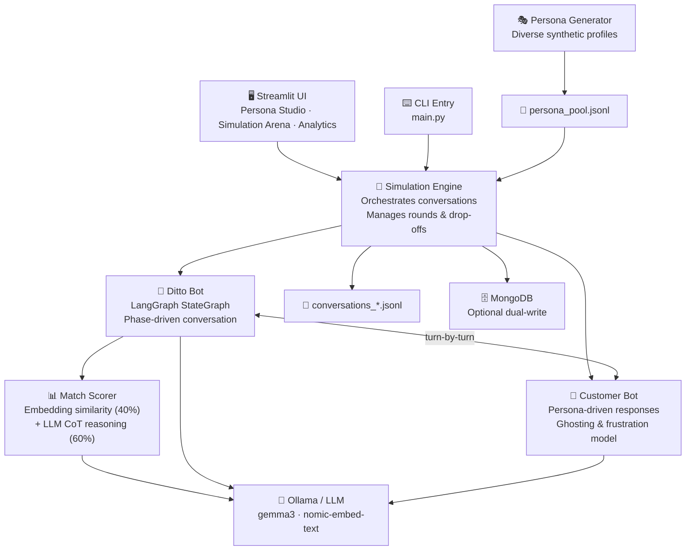

# Project Architecture — Issue #3

**Objective**: We have a bug running your last update of langgraph for conversation module. The conversation was successfully generated

```mermaid
flowchart TD
    UI["🖥️ Streamlit UI\nPersona Studio · Simulation Arena · Analytics"]
    CLI["⌨️ CLI Entry\nmain.py"]

    UI --> Engine
    CLI --> Engine

    Engine["🔄 Simulation Engine\nOrchestrates conversations\nManages rounds & drop-offs"]

    Engine --> DittoGraph["🤖 Ditto Bot\nLangGraph StateGraph\nPhase-driven conversation"]
    Engine --> CustomerBot["👤 Customer Bot\nPersona-driven responses\nGhosting & frustration model"]

    DittoGraph <-->|turn-by-turn| CustomerBot

    DittoGraph --> Matcher["📊 Match Scorer\nEmbedding similarity (40%)\n+ LLM CoT reasoning (60%)"]

    Matcher --> Ollama["🧠 Ollama / LLM\ngemma3 · nomic-embed-text"]
    DittoGraph --> Ollama
    CustomerBot --> Ollama

    PersonaGen["🎭 Persona Generator\nDiverse synthetic profiles"] --> PersonaPool["📄 persona_pool.jsonl"]
    PersonaPool --> Engine

    Engine --> ConvLogs["📄 conversations_*.jsonl"]
    Engine --> MongoDB["🗄️ MongoDB\nOptional dual-write"]
```
