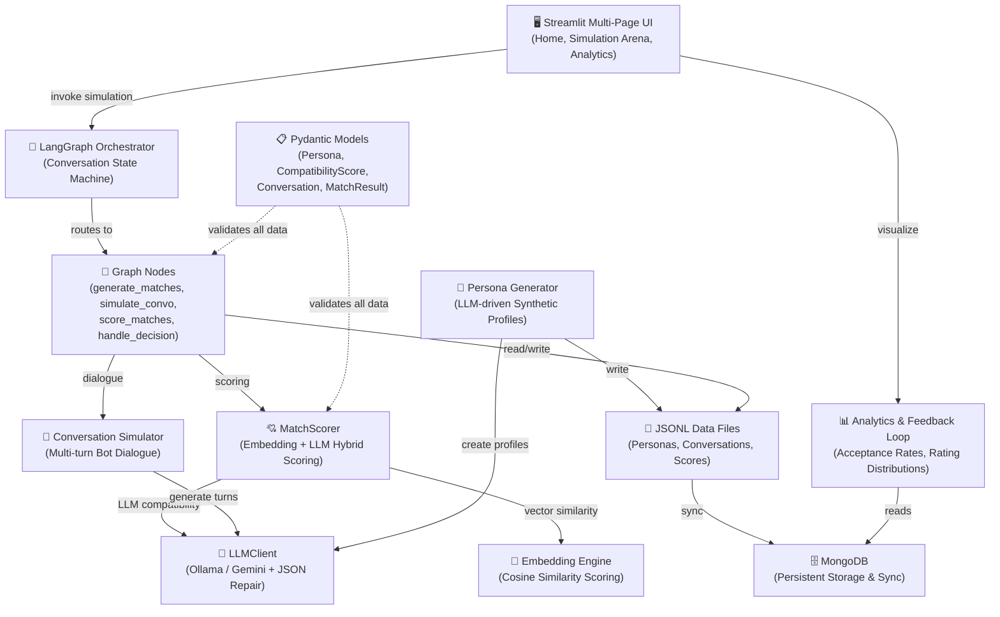

# Project Architecture — Issue #12

**Objective**: Got this error log when run the conversation simulation in UI:
ValueError: Failed to parse structured output: 1 validati

```mermaid
flowchart TD
    UI["🖥️ Streamlit Multi-Page UI\n(Home, Simulation Arena, Analytics)"]
    LG["🔄 LangGraph Orchestrator\n(Conversation State Machine)"]
    Nodes["🤖 Graph Nodes\n(generate_matches, simulate_convo,\nscore_matches, handle_decision)"]
    Matcher["💘 MatchScorer\n(Embedding + LLM Hybrid Scoring)"]
    LLM["🧠 LLMClient\n(Ollama / Gemini + JSON Repair)"]
    Personas["👤 Persona Generator\n(LLM-driven Synthetic Profiles)"]
    ConvoSim["💬 Conversation Simulator\n(Multi-turn Bot Dialogue)"]
    Embeddings["📐 Embedding Engine\n(Cosine Similarity Scoring)"]
    JSONL["📄 JSONL Data Files\n(Personas, Conversations, Scores)"]
    MongoDB["🗄️ MongoDB\n(Persistent Storage & Sync)"]
    Models["📋 Pydantic Models\n(Persona, CompatibilityScore,\nConversation, MatchResult)"]
    Analytics["📊 Analytics & Feedback Loop\n(Acceptance Rates, Rating Distributions)"]

    UI -->|invoke simulation| LG
    LG -->|routes to| Nodes
    Nodes -->|scoring| Matcher
    Nodes -->|dialogue| ConvoSim
    Matcher -->|LLM compatibility| LLM
    Matcher -->|vector similarity| Embeddings
    ConvoSim -->|generate turns| LLM
    Personas -->|create profiles| LLM
    Personas -->|write| JSONL
    Nodes -->|read/write| JSONL
    JSONL -->|sync| MongoDB
    Models -.->|validates all data| Nodes
    Models -.->|validates all data| Matcher
    UI -->|visualize| Analytics
    Analytics -->|reads| MongoDB
```
